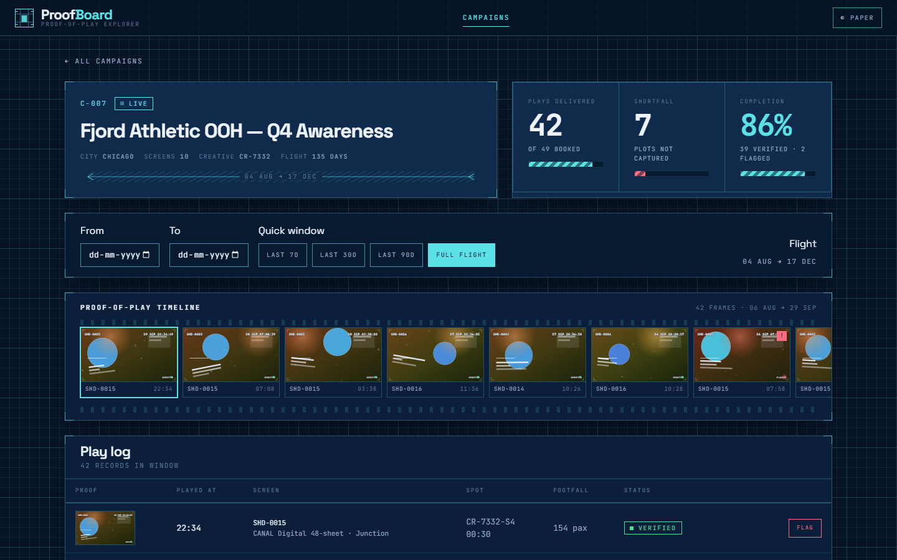
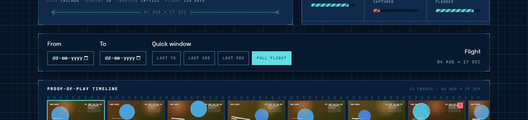

# ProofBoard

[](https://github.com/vinoth1121/ProofBoard/actions/workflows/ci.yml)
[](https://github.com/vinoth1121/ProofBoard/actions/workflows/deploy.yml)

> **Live demo → https://proofboard-lemon.vercel.app**
> Deep link straight into a campaign: https://proofboard-lemon.vercel.app/campaigns/c-007
>
> Source: [github.com/vinoth1121/ProofBoard](https://github.com/vinoth1121/ProofBoard)



An outdoor advertising campaign delivers a promise: _your ad ran, here are the
proofs_. ProofBoard is the tool an advertiser opens when that promise needs
checking — and it opens it as a **film strip**, one frame per verified play,
with the screen ID and timestamp burned into each frame.



---

## The pitch

Most proof-of-play tools hand you a CSV of play logs and expect you to trust it.
ProofBoard shows you the timeline. Forty-two plays across ten screens read as
forty-two frames; a gap in the schedule is a visible gap in the strip; a screen
that ran twice an hour looks strange because the frames sit next to each other.

Everything else follows from that: the numbers on the header are the ones you
argue about, every frame is clickable, and if something looks wrong you flag it
in one keystroke.

**Stack:** React 18 · Vite · TypeScript (strict) · React Router · plain CSS
Modules · Mock Service Worker · Vitest + React Testing Library

---

## Why this is different

### 1. A visual proof-of-play timeline, not a table of numbers

The film strip is the product. Each frame is a generated SVG "capture" — a
colour-field composition derived deterministically from the play record, with
the screen ID, date and time stamped into the image itself, a camera-ish
vignette, scanlines, and a status lamp. Uncorroborated plays are hatched amber,
flagged plays carry a red badge. Nothing is stock photography: the artwork is
drawn from the data, so it is stable, weighs ~2 KB, and cannot drift from the
row it represents.

_Why it matters:_ an auditor can scan 40 frames in two seconds and spot the
anomaly before reading a single number.

### 2. All filter state lives in the URL

Search, status, city, sort direction, page **and** the detail page's date window
are query-string state. `/campaigns?status=live&city=Chicago&sort=completion&dir=desc&page=2`
is a complete, shareable view; back/forward walk the filter history; a shared
link reproduces the screen exactly. The debounced search commits with
`replace` so typing does not fill the back button.

_Why it matters:_ "can you send me the screen where…" stops being a support
ticket and becomes a copy-paste.

### 3. Optimistic updates that actually roll back

Flagging a play as suspicious paints the change immediately and reconciles
silently. The mock registry rejects flag writes ~10% of the time, and when it
does the row snaps back and a stamped banner explains why. The rollback
restores an exact snapshot rather than decrementing a counter, so header stats
can never drift from the rows on screen.

### 4. A realistic API, in the browser, in production

There is no backend. MSW intercepts `/api/*` in **dev, preview and the deployed
production build**, with 400–900 ms artificial latency and a ~10% failure rate
on the plays endpoint. That means the skeletons, error states, retry buttons
and rollback paths are not decoration — they are the default experience, and the
live demo needs no server.

### 5. Blueprint, not dashboard

Deep navy `#0B1F3A`, cyan `#5CE1E6` line work, a two-tier drafting grid, white
mono microlettering, corner crop marks and dimension rules with sloped end
ticks. Space Grotesk for headings, JetBrains Mono for data, both with full
fallback stacks. A light "paper blueprint" theme ships alongside it. No UI kit.

---

## Features

|                        |                                                                                                                                                                |
| ---------------------- | -------------------------------------------------------------------------------------------------------------------------------------------------------------- |
| **Campaign index**     | Debounced search, status/city filters, five sort keys with direction, pagination, all URL-synced                                                               |
| **Campaign detail**    | Delivered vs booked, shortfall and completion stats, film-strip timeline, play log table, date-range filter with 7/30/90-day presets                           |
| **Proof modal**        | Focus-trapped, `Esc` closes, `←`/`→` step through frames, restores focus to the trigger                                                                        |
| **Flag as suspicious** | Optimistic paint, per-play pending spinner, exact rollback, dismissible error banner                                                                           |
| **States**             | Blueprint skeletons, error panels with retry, drawn empty states, 404 sheet                                                                                    |
| **Code splitting**     | Detail route is a `React.lazy` chunk (24 kB) fetched on demand                                                                                                 |
| **A11y**               | Semantic landmarks, `aria-live` result counts, `aria-pressed` filters, `aria-current` pagination, full keyboard operability, `prefers-reduced-motion` honoured |

### Keyboard map

| Key                 | Action                                                      |
| ------------------- | ----------------------------------------------------------- |
| `Tab` / `Shift+Tab` | Move through frames and controls (trapped inside the modal) |
| `Enter` / `Space`   | Open the focused proof frame                                |
| `←` `→`             | Previous / next frame (in the modal)                        |
| `Esc`               | Close the modal                                             |

---

## Architecture

```
                            ┌──────────────────────────────────────────┐
   URL query string  ──────▶│  useUrlState<T>  (hooks/useUrlState)     │
   "?status=live&page=2"     │  parse ⇄ serialize, replace-aware        │
                            └───────────────────┬──────────────────────┘
                                                │ CampaignListFilters
                            ┌───────────────────▼──────────────────────┐
                            │  useDebounce / useDebouncedCallback      │
                            │  collapse keystrokes, settle to the URL  │
                            └───────────────────┬──────────────────────┘
                                                │
      ┌─────────────────────────────────────────▼──────────────────────────────────┐
      │  useRequest<T>  — abort stale work, sequence-guard races,                │
      │                    isPending (skeleton) vs isRefreshing (stale-while-revalidate) │
      └───────┬───────────────────────────────────────────────┬───────────────────┘
              │                                               │
   useCampaigns(filters)                          usePlays({id, from, to})
              │                                               │
              │                                     mutate() ◀── optimistic flag
              │                                               │ rollback on failure
              │                                               ▼
   ┌──────────▼───────────────────────────────────────────────▼──────────────────┐
   │  features/campaigns            │  features/plays                             │
   │   CampaignListPage             │   CampaignDetailPage  (React.lazy chunk)    │
   │   CampaignFilters              │   StatsHeader · DateRangeFilter            │
   │   CampaignCard                 │   FilmStripTimeline  ◀── the signature     │
   │   Pagination                   │   PlayTable · ProofModal (focus trap)      │
   └──────────┬────────────────────┴───────────────┬──────────────────────────────┘
              │                                    │
              └──────────────┬─────────────────────┘
                             ▼
   ┌────────────────────────────────────────────────────────────────────────────┐
   │  lib/                                                                     │
   │   types.ts · filters.ts ◀── PURE filter/sort/paginate, shared by the UI    │
   │   api.ts   · format.ts · rng.ts · router.ts          and the mock server   │
   └──────────────────────────────┬─────────────────────────────────────────────┘
                                  │  fetch('/api/...')
                                  ▼
   ┌────────────────────────────────────────────────────────────────────────────┐
   │  mocks/  (MSW — runs in the browser in dev AND production)                 │
   │   browser.ts · server.ts · handlers.ts · db.ts (seeded) · config.ts        │
   │   db.ts: 24 campaigns · 500+ plays · mulberry32(0xb00a24) · fixed anchor   │
   │   handlers: 400–900 ms delay · ~10% failure on GET /plays · 409 on flag   │
   └────────────────────────────────────────────────────────────────────────────┘
```

**Layering rule:** `lib/filters.ts` is pure and framework-free, and _both_ the
React list and the mock handlers call it. The view and the "server" therefore
cannot disagree about what a filter means — and the filter logic is unit-tested
without rendering anything.

**Data flow for a flag:**
`click → snapshot data → mutate(local) → POST → success: drop snapshot` /
`→ failure: restore snapshot + surface reason`. Pending and error state live in
`usePlays`, so the UI never has to reason about request bookkeeping.

---

## Running it locally

```bash
npm install
npm run dev          # http://localhost:5173  (MSW starts automatically)
```

Everything below is one command:

```bash
npm run dev        # dev server
npm run build      # typecheck + production build
npm run preview    # serve the built bundle, MSW still active
npm test           # 72 tests (Vitest + RTL)
npm run test:watch # watch mode
npm run lint       # ESLint, zero warnings tolerated
npm run format     # Prettier write
npm run typecheck  # tsc -b
npm run smoke -- https://proofboard-lemon.vercel.app   # real-Chrome smoke test
```

`npm run smoke` drives a **running deployment** — local or live — in your
installed Chrome or Edge (Playwright core, no browser download) and asserts 16
behaviours end to end: cards render from the mock API, filter state round-trips
through the URL, `/campaigns/c-007` survives a hard refresh, the modal traps
focus and steps frames with arrow keys, flagging paints optimistically and then
settles (committed or rolled back), empty and 404 states draw, the theme toggles,
and nothing unexpected reaches the console. Point it at production to verify a
deploy:

```bash
npm run smoke -- https://proofboard-lemon.vercel.app
```

Adding `--shots <dir>` captures the README frames (the film-strip panning
sequence, both palettes and the index) from a local preview server:

```bash
npm run build
npm run preview &
npm run smoke -- http://localhost:4173 --shots docs/shots
```

**Quality gates:** TypeScript `strict` + `noImplicitOverride` +
`noImplicitReturns` + `exactOptionalPropertyTypes`, ESLint with
`@typescript-eslint/no-explicit-any: error` and zero-warning budget, Prettier,
and 72 tests over 7 files — filter/sort/paginate logic, URL serialisation,
debounce semantics, seeded-data invariants, the four REST endpoints, the
optimistic-update and rollback path, and the detail route end to end.

---

## Continuous integration

Two workflows in `.github/workflows/`, both triggered by a push to `main`:

```
git push
   │
   ├──▶ CI        (ci.yml)  format:check → lint → typecheck → test → build
   │                       │
   │                  all green ──▶ uploads dist/ as an artifact
   │                       │
   │                  any red ──▶ stops here
   │
   └──▶ Deploy    (deploy.yml, fires on workflow_run = CI completed + success)
              ├──▶ job: deploy  — POSTs the Vercel deploy hook
              └──▶ job: verify  — asserts the live site actually serves
                                 deep links, the SPA rewrite and the MSW worker
```

**`ci.yml`** runs on Node 24 (the version Vercel builds with), caches `npm`,
cancels superseded runs on the same ref, and needs only `contents: read`
permission. It is the gate: a red commit is visible on the push before anything
reaches production.

**`deploy.yml`** is where CI becomes the thing that decides to deploy. Its
`verify` job is the check unit tests cannot do — it hits the live URL and
asserts that `/campaigns/c-007` returns the SPA shell, that
`/mockServiceWorker.js` is served, and that an unknown route falls back to
`index.html`. That is the exact failure mode an SPA rewrite or a missing
service worker would cause in production, and it is invisible to jsdom.

**The gate is closed: exactly one production build per push, and only after CI is
green.** Three pieces make that true:

1. **A Vercel deploy hook** (`github-actions-ci`, branch `main`), whose URL is
   stored as the GitHub Actions secret `VERCEL_DEPLOY_HOOK_URL`.
2. **`git.deploymentEnabled` in `vercel.json`**, which switches off Vercel's own
   automatic Git deployment for `main` while leaving every other branch alone:

   ```json
   { "git": { "deploymentEnabled": { "main": false } } }
   ```

   Per Vercel's published schema, this field names "the branches that will not
   trigger an auto-deployment when committing to them. Any non specified branch is
   `true` by default" — so feature branches still get previews, and only `main`
   is gated.

3. **`deploy.yml`**, whose `workflow_run` trigger fires only when CI concluded
   `success`, and whose `verify` job then asserts the live site actually serves
   deep links, the SPA rewrite and the MSW worker — the failure mode jsdom
   cannot see.

Proof it is a real gate, from the push that introduced step 2 (`ffdaebb`):

```
10:49:35  push
10:49:42  CI started
10:50:27  CI finished — success
10:50:29  Deploy workflow started      (workflow_run, conclusion = success)
10:50:40  Vercel deployment created    <- the hook, firing inside the job
10:50:45  Deploy finished — success
```

There is no build at the ~10:49:40 mark where the Git integration used to deploy
on its own. Before that commit every push produced two deployments (`d85b358`,
`dfaad80`); `ffdaebb` produced one.

Without the secret the `deploy` job does not fail — it emits a `::notice` and
exits 0, so anyone who clones this repo can run it with no configuration at all.
That is the safe default: a missing secret should not break the repository.

---

## Design notes

- **The theme is applied before first paint.** A tiny inline script in
  `index.html` reads `localStorage` and sets `data-theme` on `<html>`, so
  there is no flash of the wrong palette; `useTheme` then keeps it in sync.
- **CSS Modules only.** Class names are camelCase so `styles.foo` matches the
  source exactly. All colour, type, spacing, motion and line weights come from
  custom properties in `styles/tokens.css`, which is why the light theme is a
  ~30-line override rather than a second stylesheet.
- **Race safety.** `useRequest` tags each request with a monotonic sequence and
  ignores any response that is not the newest, so fast filter changes cannot
  render stale data.
- **One realm-check, honestly documented.** Passing an `AbortSignal` to `fetch`
  fails where the signal and the fetch implementation come from different
  realms (jsdom under Vitest). `lib/api.ts` probes this once with the platform's
  own `Request` and degrades to "no signal" — the caller's abort guard still
  prevents stale commits.
- **No `any`, anywhere** — enforced by a lint rule rather than by convention.

---

## What I'd build next

1. **Real proof media.** The generated SVG frames are the honest stand-in for
   camera captures. Next: an upload pipeline for screen-sourced frame grabs,
   with perceptual hashing to spot duplicate or reused captures across
   campaigns — the actual fraud vector in OOH verification.
2. **Timeline analytics.** A density strip (plays per day/hour) with anomaly
   highlighting, so "nothing ran on 12 August" is visible without counting
   frames. Completion trends per campaign over its flight.
3. **Dispute workflow.** Flags currently mutate local state. Next: a review
   queue, an audit trail, credit notes tied to shortfall, and export to PDF for
   the media-agency conversation.
4. **Virtualised timeline.** Campaigns with tens of thousands of plays need
   windowed rendering; the film strip should handle 100k frames without
   dropping below 60 fps.
5. **URL state that survives the API.** Today filters live in the query string
   but the API contract is re-derived per request. A normalised, shareable
   filter grammar (`?q=&status=live,ended&range=30d&sort=-completion`) with
   parsed-and-versioned URLs.
6. **Offline-first.** A service worker is already in place for MSW; the same
   layer could cache recent play logs so an auditor can review in a tunnel.
7. **Split the mock out of the bundle.** Production currently ships the mock
   worker (~90 kB gzip). A build flag would let a real deployment talk to a real
   API without touching a line of application code — which is the whole point
   of keeping `lib/api.ts` as the only network boundary.

---

## Licence

MIT
